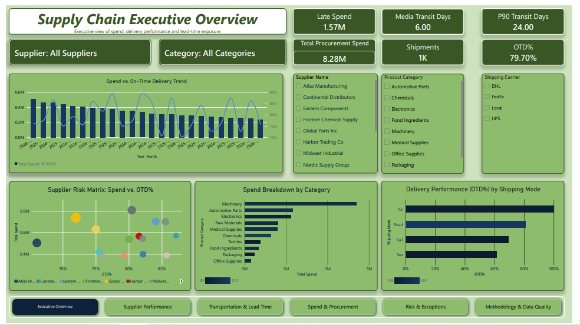

# Supply Chain Performance & Procurement Analytics

**Interactive Power BI Dashboard | Procurement | Supplier Performance | Logistics | Cost Analysis**

An end-to-end analytics project exploring procurement spending, supplier delivery performance, transportation modes, and lead-time variability using a shipment-level dataset of 1,000 records.

---

## Dashboard Preview

*Executive overview of procurement spend, delivery performance, and supply chain indicators.*

---

## 1. Business Problem

Procurement and supply chain teams need visibility into spending patterns, supplier reliability, transportation performance, and delivery lead times to support operational decisions.

This project analyzes shipment data to identify performance gaps, spending concentration, and operational risk signals.

### Business Questions

- How is procurement spend distributed across suppliers and product categories?
- Which suppliers show lower on-time delivery performance?
- How do transportation modes relate to transit time and delivery performance?
- How much spending is associated with late shipments?
- What operational patterns deserve further investigation?

---

## 2. Dashboard Features

The Power BI report is organized into the following analytical sections:

1. **Executive Overview** — Main KPIs and overall supply chain performance.
2. **Supplier Performance & Spend Exposure** — Supplier-level delivery performance and spending concentration.
3. **Transportation & Lead Time Analysis** — Transit time and delivery performance by shipping mode.
4. **Procurement Spend & Cost Analysis** — Spending patterns across categories and suppliers.
5. **Operational Exceptions & Risk Signals** — Areas requiring further review.
6. **Data Methodology & Quality** — Data preparation, definitions, and analytical limitations.

---

## 3. Key Findings

The analysis covers 1,000 shipment records from January 2024 to December 2025.

- **Total procurement spend:** approximately $8.28M.
- **Total quantity:** approximately 2.40M units.
- **On-time delivery rate:** 79.7%.
- **Late shipments:** 203 out of 1,000.
- **Spend associated with late shipments:** approximately $1.57M, representing 19.0% of total spend.
- **Average transit time:** 9.5 days.
- **Average order-to-delivery lead time:** 11.6 days.

### Supplier Performance

Supplier delivery performance varies across the dataset. For example:

- Atlas Manufacturing: 66.1% on-time delivery.
- Global Parts Inc: 72.0% on-time delivery.
- Midwest Industrial: 85.5% on-time delivery.
- Pacific Supply Co: 87.1% on-time delivery.

These differences provide a basis for supplier review and further investigation.

### Transportation Performance

The dataset shows differences in average transit time and on-time delivery by transportation mode:

- Air: 2.9 average transit days; 100% on-time delivery.
- Road: 5.8 average transit days; 80.8% on-time delivery.
- Rail: 10.3 average transit days; 69.6% on-time delivery.
- Sea: 28.4 average transit days; 61.4% on-time delivery.

These figures describe the observed dataset and should not be interpreted as proof that transportation mode alone caused delivery outcomes.

For additional detail, see [Key Findings](documentation/key_findings.md).

---

## 4. Tools & Methodology

**Tools**
- Microsoft Power BI
- Power Query
- DAX
- Microsoft Excel

**Analytical workflow**
1. Reviewed the shipment dataset and its structure.
2. Checked data quality, including missing values, duplicate shipment IDs, and date consistency.
3. Prepared and transformed fields for analysis.
4. Created calculated indicators for delivery performance, lead time, and cost.
5. Designed KPI views and report pages.
6. Analyzed supplier, category, and transportation patterns.

Only tools and steps actually used in the final project should be considered part of the completed workflow.

---

## 5. Data Model & KPIs

The project uses shipment-level records and calculated measures to summarize procurement and delivery performance.

**Main KPIs**
- Total Spend
- Total Quantity
- On-Time Delivery (OTD)
- Late Shipments
- Late Spend
- Average Transit Days
- Average Order-to-Delivery Lead Time

**Calculated fields**
- Order-to-Ship Days
- Transit Days
- Total Lead Time
- Cost per Unit
- On-Time Flag
- Late Flag
- Late Spend

See the project documentation:
- [Data Model](documentation/data_model.md)
- [DAX Measures](documentation/dax_measures.md)
- [Methodology](documentation/methodology.md)

---

## 6. Data Quality & Limitations

The dataset contains 1,000 shipment records covering January 2024 through December 2025. The initial quality review found no missing source values, no duplicate shipment IDs, and no negative date intervals.

**Important limitations**

The available data does not include:
- Promised delivery dates.
- Ordered versus received quantities.
- Inventory balances.
- Demand forecasts.
- Safety stock or reorder points.
- Historical purchase prices.
- Separately identified freight costs.

Therefore, this project does not calculate true OTIF, fill rate, inventory turns, stockout rate, forecast accuracy, purchase-price variance, or realized savings.

Late spend represents the procurement cost associated with late shipments. It is not a measure of financial loss or savings.

---

## 7. How to Explore the Project

1. Review the dashboard preview in the `screenshots` folder.
2. Explore the Power BI report in the `powerbi` folder, if the PBIX file is available.
3. Read the detailed findings and methodology in the `documentation` folder.
4. Review the KPI definitions and data model to understand how the analysis was built.

---

## 8. About the Author

**Dionner Hernandez**  
Computer Science Engineer | Business Operations | Procurement | Supply Chain Analytics

Business operations professional with 12+ years of hands-on experience managing B2B industrial services, procurement, supplier relationships, inventory, logistics, pricing, and cost analysis.

Currently developing data analytics capabilities with Excel, SQL, and Power BI to support business performance monitoring and data-driven decision-making.

**Areas of interest**
- Business Operations & Business Analysis
- Procurement & Supplier Performance
- Supply Chain Analytics
- Cost & Pricing Analysis
- Process Improvement

---
